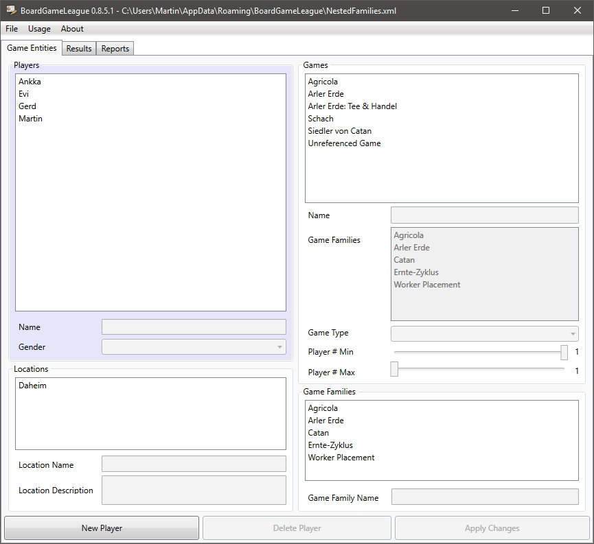
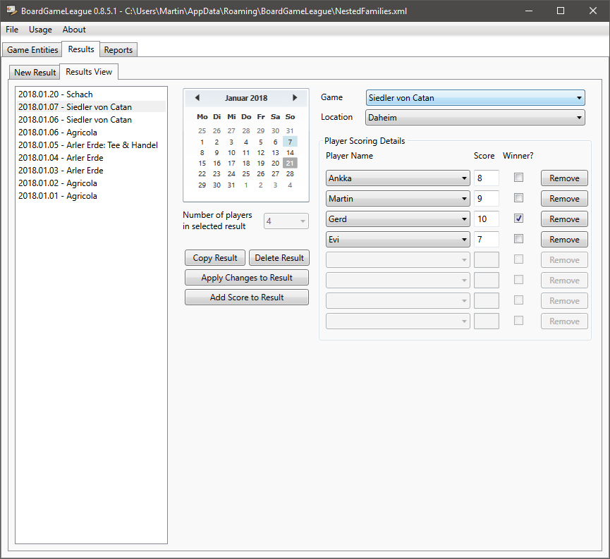
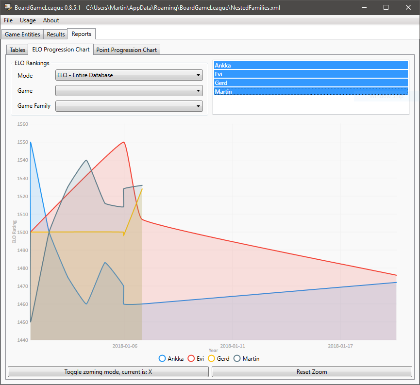
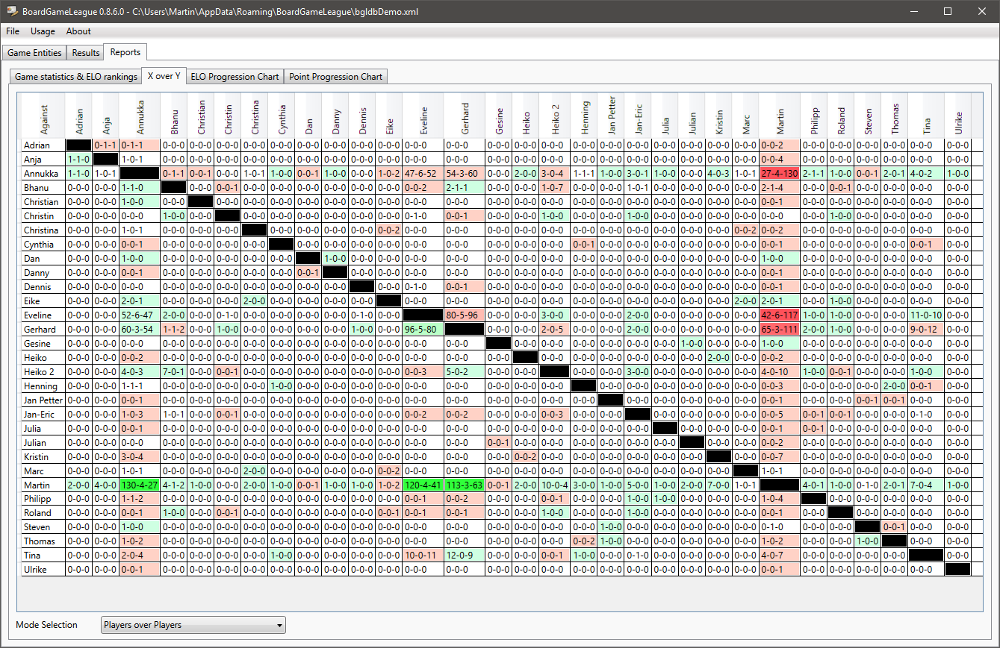
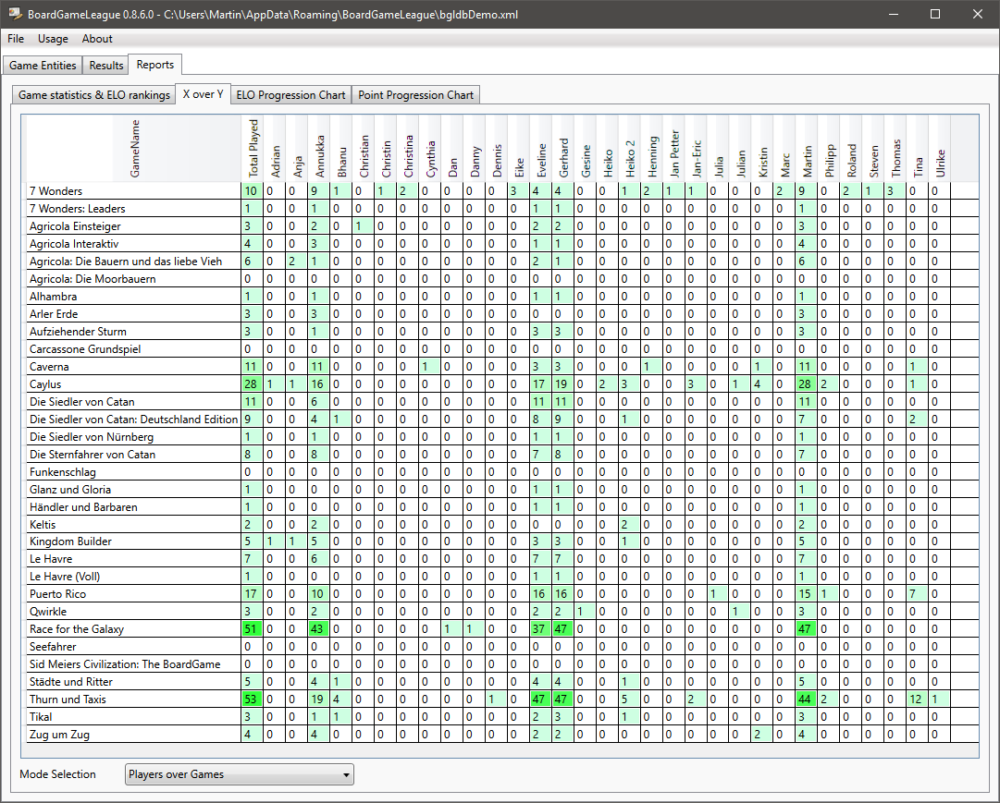
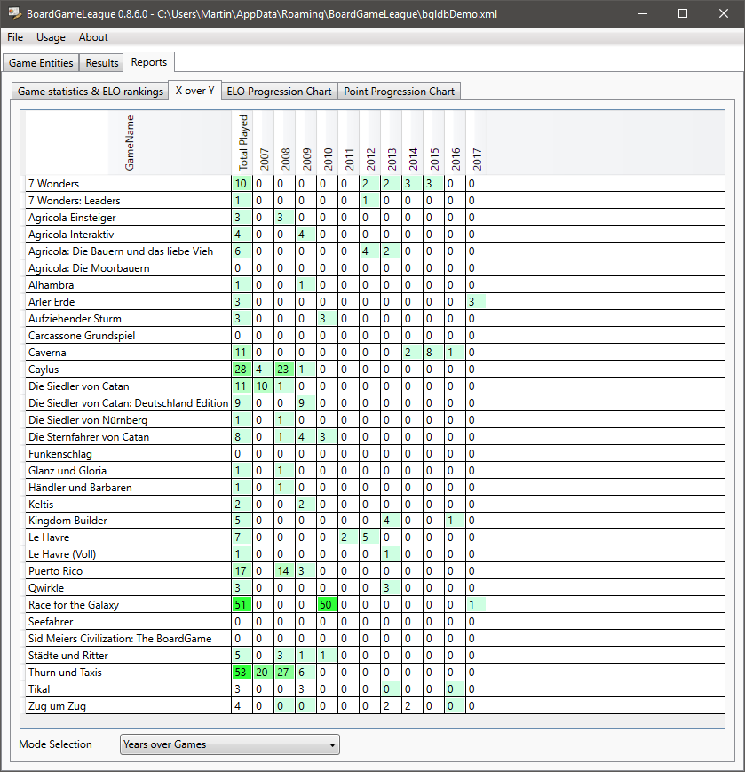

# BoardGameLeague

BoardGameLeague is a desktop application for Windows to track the results of boardgaming sessions.

## Getting Started

.NET 4.6.1 is needed to run BoardGameLeague.

### Compiling on and running on your own

You need Visual Studio 2017 to build BoardGameLeague.  I tried to keep dependencies as flat as possible. 
From the below libraries grip is optional and the chart library mandatory. Apart from that *Build Solution* will work out of the box.

#### grip

`grip` is needed to generate the HTML documentation (from the ABOUT.md). If you don't want to install grip, 
simply comment or remove this line from the build events:

```
grip "$(ProjectDir)\..\ABOUT.md" --export "$(ProjectDir)\bin\$(Configuration)\about.html
```

If you **want** to use grip: You need a Python 3.6 installation and install grip with:

```
pip install grip
```

And then add the path to the exe and the Python paths to your environment variable. For me they are:

* C:\Program Files (x86)\Microsoft Visual Studio\Shared\Python36_64\Scripts\
* C:\Program Files (x86)\Microsoft Visual Studio\Shared\Python36_64\

#### LiveCharts.WPF

Just use **NuGet** to [install](https://lvcharts.net/App/examples/wpf/Install) the LiveCharts.Wpf library.

## Features

Please consult the [about page](ABOUT.md) for the feature set and future plans. See the following screenshots for examples.

### Manage your raw data

#### Entity Entry

BoardGameLeague supports the creation of entities (like games, players, game families and locations).



#### Result View

Existing results can be edited:



### View Reports of Collected Data

#### Elo Progression

We can select players and e.g. see their ELO score progression for all results:



#### Players over Players

Shows how all players performed against all players (but themselves; colored in black). The format is wins, stalemates and losses.



#### Players over Games

Shows which games have been played by which players.



#### Years over Games

Shows all games in which years they were played.



## Author

* *Martin Woelke* - contact me under bgl.boardgameleague at gmail.com.

## Test and Feedback

* Annukka Nitsche-Woelke
* Bijo Varghese
* Jayakrishnan Kollaikkal
* Eveline Woelke
* Julian Kippels
* Roland Heise

## Built With

* [log4net](https://logging.apache.org/log4net) - A port of the excellent Apache log4j™ framework to the Microsoft® .NET runtime. Licensed under the [Apache License, Version 2.0](BoardGameLeague/licenses/Apache2.txt).
* [NUnit](http://nunit.org) - A unit-testing framework for all .Net languages. Licensed under [MIT license](BoardGameLeague/licenses/mit.txt).
* [grip](https://github.com/joeyespo/grip) - Render local readme files before sending off to GitHub.
* [LiveCharts](https://lvcharts.net) - A C# charting library. Licensed under the [Apache License, Version 2.0](BoardGameLeague/licenses/Apache2.txt).

## FAQ

### Why is BoardGameLeague not on platform _x_ and framework _y_?

BoardGameLeague is a leisure activity and a product for my gaming groups. I like the technology behind it 
(databinding with WPF and XML as a database) and wanted to apply and enhance what I already knew.
